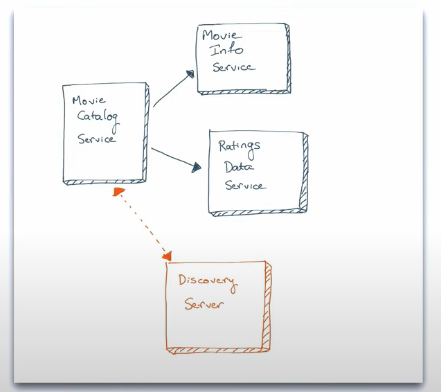
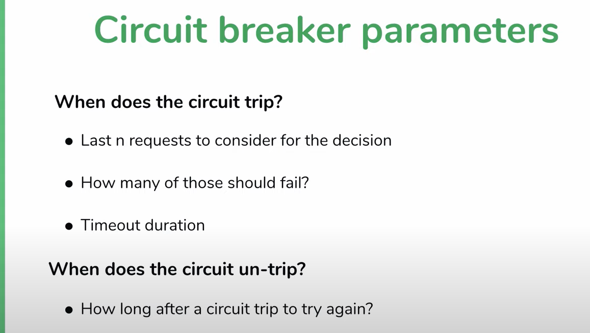
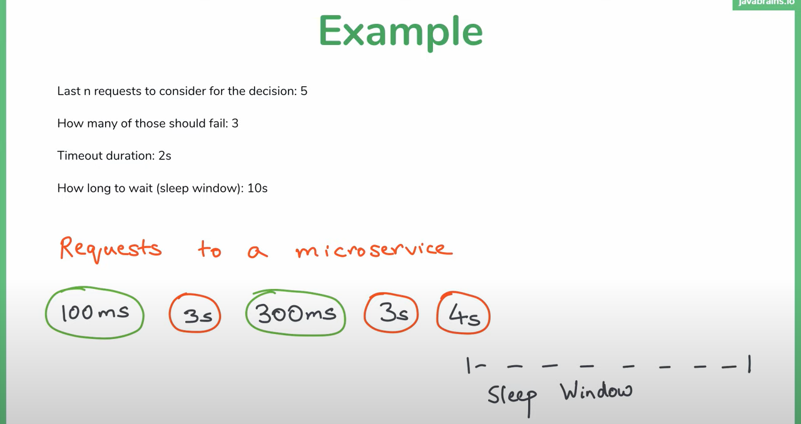
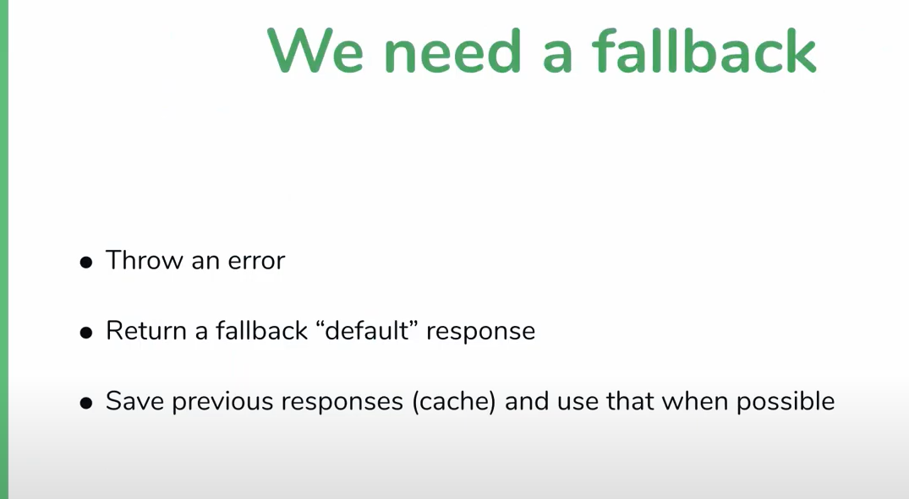

#Level1
### Server side discovery
Consumer of the service will call discovery-service and get the address. then consumer service will call producer service
### Client Side Discovery
Consumer of the service will call discovery-service and ask to get response from producer service.

### Spring cloud - eureka | uses client side discovery

Netflix built many libraries for microservices which is working well with spring boot.

Eureka - Service Discovery Pattern

Ribbon, 

Hystrix - Circuit Breaker Pattern

default port for eureka server is 8761. that is why every client knows where it will find eureka server

but if eureka server is running on diff port then we have to change config and tell client the address of eureka server

###Fault Tolerance
Eureka is using Caching.

so if service goes down and eureka does not know
then consumer can call the service

which is call fault tolerance.

###Can solve by heartbeats
Every service has to send message that says  I AM ALIVE to eureka.

and if eureka does not receive that message in certain time then it declared that service as dead and will remove the service from list 

###what if eureka service goes down
Here it comes cache into the picture

if consumer won't find any response from service discovery then it will find from cache for now.

#Level2

###what is Fault Tolerance - How Much
if there is a fault, what will be the impact of fault

if one service goes down - what is gonna happen to your microservices

what tolerance your system has for particular fault

* MicroService is slow
* Microservice is down

Temporary Solution could be **set timeout** <- not proper solution

**Steps for solutions - Circuit Breaker Pattern**

[Interrupt the current flow after fault is detected]

* Detect something is wrong

Identifies that service is slow or down

* Take temporary steps to avoid the situation getting worse

it won't make call to particular microservice for sometime

When circuit breaker happens what to send response to consumer or client

**Circuit breaker pattern**

* When to break circuit
* What to do when circuit breaks
* When to resume requests

###what is resilience - How Many
How many fault the system tolerate. that indicates how resilient it is

### **BulkHead Pattern adding into Hystrix**

Bulkhead pattern means dividing threads between two service calls via thread pool.
so each service call will use its own thread. so it won't affect other service call if one of them is down

just to add threadPoolKeys & threadPoolProperties