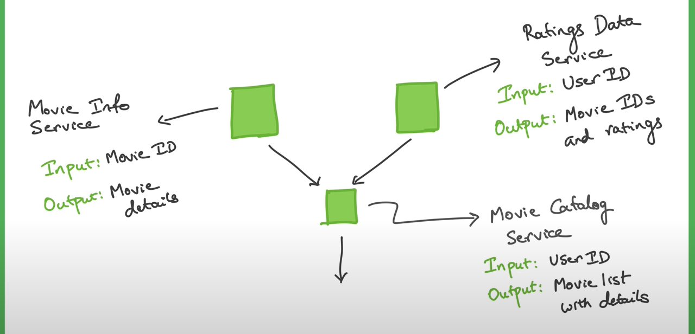

### movie-catalog-service
Will provide data from movie listing user watched by user id
### movie-info-service
will provide data of movie  by id
### ratings-data-service
will provide data of ratings and movie id by user id

Tomcat will inside spring boot project via API

Always return object rather than list. wrap your list in object and send

you can check eg in http://localhost:8083/ratingsdata/users/foo

@Autowired is consumer. someone needs to produce like @Bean or @RestController, @Service, @Repository

Lazy Initialize Bean, Eager Initialize Bean. Default is lazy

RestTemplate is Thread Safe